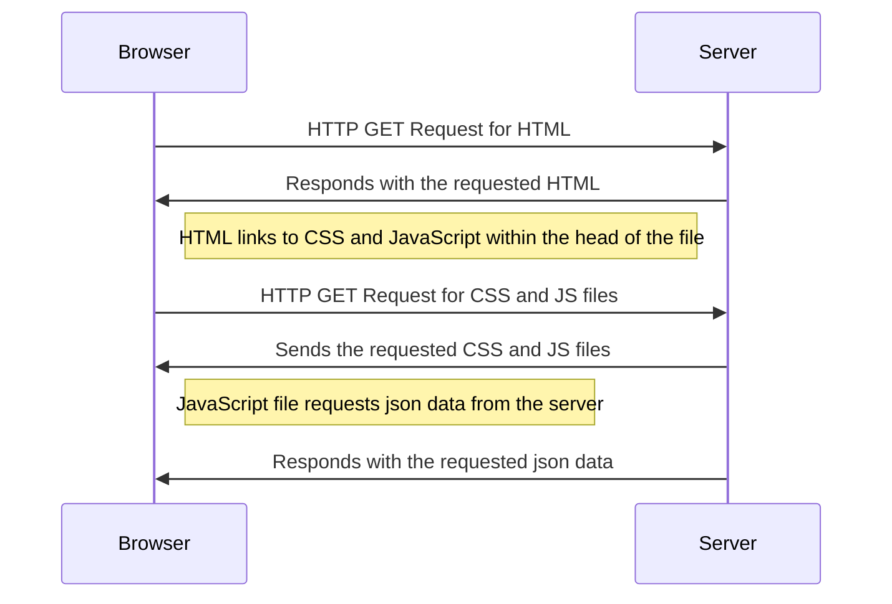

# Single Page Application Diagram

```mermaid
sequenceDiagram
Browser->>Server: HTTP GET Request for HTML
Server->>Browser: Responds with the requested HTML
Note right of Browser: HTML links to CSS and JavaScript within the head of the file
Browser->>Server: HTTP GET Request for CSS and JS files
Server->>Browser: Sends the requested CSS and JS files
Note right of Browser: JavaScript file requests json data from the server
Server->>Browser: Responds with the requested json data
```
