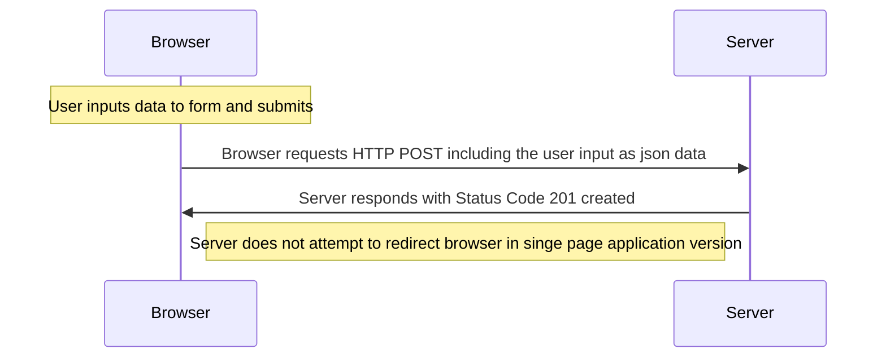

# New Note Creation in Single Page App Diagram

```mermaid
sequenceDiagram
Note over Browser: User inputs data to form and submits
Browser->>Server: Browser requests HTTP POST including the user input as json data
Server->>Browser: Server responds with Status Code 201 created
Note left of Server: Server does not attempt to redirect browser in singe page application version
```
